# Sapcast — Feature Walkthrough

A tour of everything Sapcast does, from first load to the tapping guides.

> **The weather in these screenshots is synthetic.** Sapcast is only useful for
> about three weeks a year — outside the season there is no freeze-thaw in the
> live forecast, every day rates *poor*, and most of the interface can't be
> exercised. So these captures run against a demo server that serves canned
> temperatures for a faux **10 March 2026** at **45.35, -75.75** (Ottawa
> valley).
>
> The temperatures are the only fabricated input. They are fed through the real
> [`src/weather.ts`](src/weather.ts) and [`src/scoring.ts`](src/scoring.ts), so
> every rating, best window, recommendation and season date shown below is what
> the production code actually computes. See
> [Reproducing these screenshots](#reproducing-these-screenshots).

## Contents

- [The whole picture](#the-whole-picture)
- [Working out where you are](#working-out-where-you-are)
- [Choosing your units](#choosing-your-units)
- [The recommendation, in five flavours](#the-recommendation-in-five-flavours)
- [Season timing](#season-timing)
- [The 7-day forecast](#the-7-day-forecast)
- [Where the numbers come from](#where-the-numbers-come-from)
- [Knowing when is only half of it](#knowing-when-is-only-half-of-it)
- [Telling us how it went](#telling-us-how-it-went)
- [On a phone](#on-a-phone)
- [Reproducing these screenshots](#reproducing-these-screenshots)

## The whole picture

One screen, no navigation, no accounts. Sapcast asks for your location, then
answers the only question that matters: *should I be tapping?*

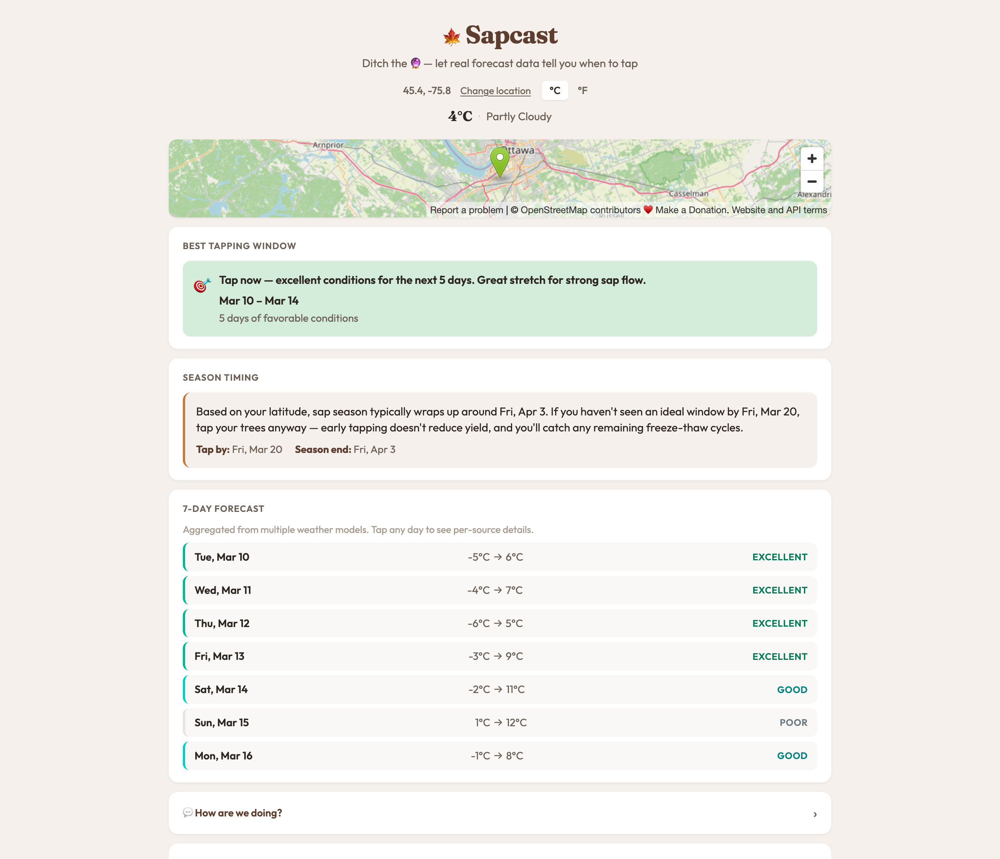

Top to bottom: where you are and current conditions, a map to confirm it got
the right spot, the headline recommendation, how your latitude's season is
tracking, and the seven-day breakdown.

## Working out where you are

Sapcast asks the browser for your location on load. Nothing is typed, and no
account exists.

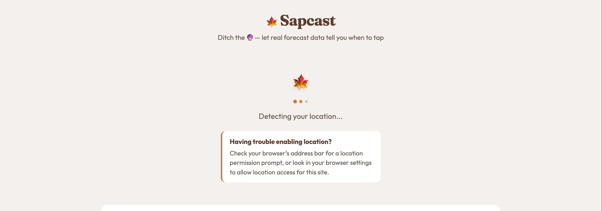

If the permission prompt goes unanswered for 13 seconds, a hint appears with
OS-specific instructions (iOS, Android and desktop each get different advice).

Once located, the header shows the coordinates, current temperature and
conditions.


### If location is blocked

Denying the prompt isn't a dead end — you get the reason, the OS-specific help,
a retry, and a ZIP/postal-code fallback.

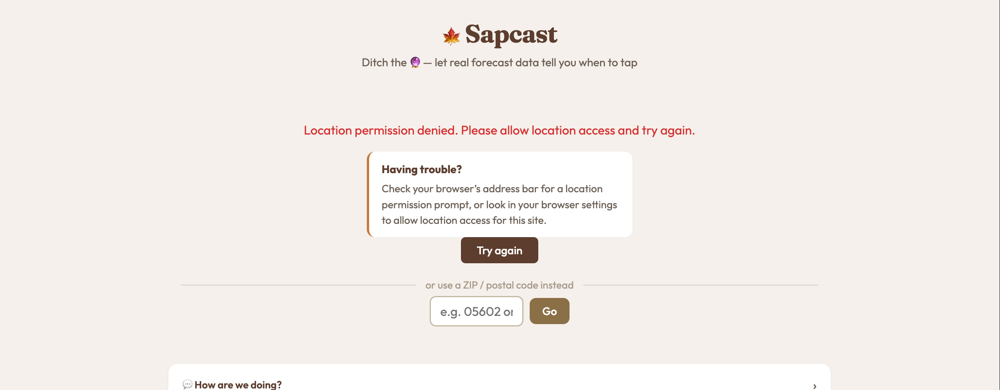

### Changing location on purpose

Useful when the sugarbush isn't where you're standing. **Change location**
opens a postal-code box; codes starting with a letter are treated as Canadian
FSAs, digits as US ZIPs.

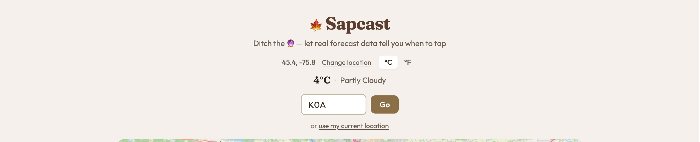

The lookup is geocoded server-side (and cached for 30 days), and the map moves
to match. The location label switches to the code you entered.

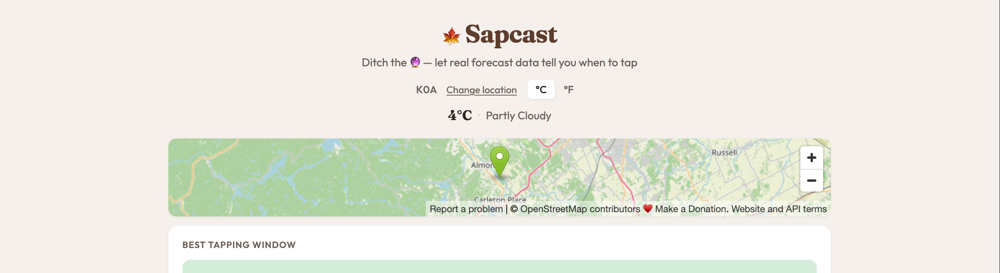

## Choosing your units

Everything is scored in Celsius internally; the toggle only changes what you
read. It re-renders in place — no refetch.


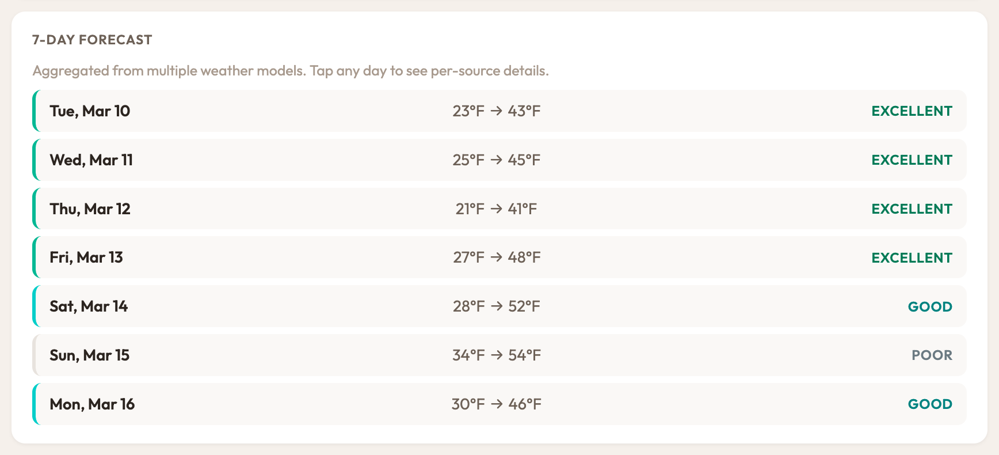

## The recommendation, in five flavours

The recommendation is derived from the longest consecutive run of good-or-better
days, and reads differently depending on what the week looks like.

<!-- markdownlint-disable MD013 -->
| State | When you see it | Colour |
| ----- | --------------- | ------ |
| **Tap now** | A qualifying run starts today | Green |
| **Upcoming** | The run starts later in the week | Amber |
| **Brief window** | The best run is a single day — not worth much sap | Neutral |
| **Too cold** | Nothing rises above freezing; the season hasn't started | Blue |
| **Season over** | No freezing nights left in the forecast | Red |
<!-- markdownlint-enable MD013 -->

**Tap now** — five straight freeze-thaw days from -5 °C to 6 °C onward. The
average score is high enough to be called *excellent* rather than merely good,
and past three days it adds the "great stretch" note.

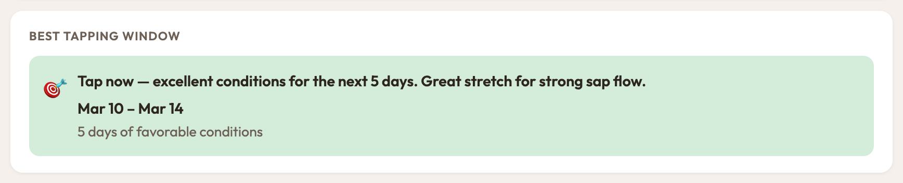

**Upcoming** — the week opens too warm to freeze, then a solid three-day run
arrives on the Friday.

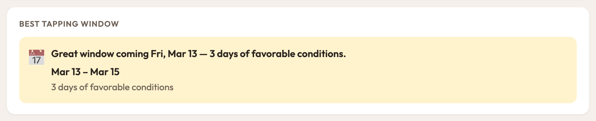

**Brief window** — there *is* a perfect day in there, but one day alone doesn't
fill buckets, so Sapcast says so instead of overselling it.

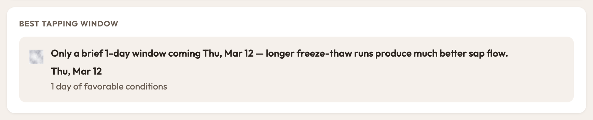

**Too cold** — a deep freeze where highs never clear 2 °C. No thaw, no flow.

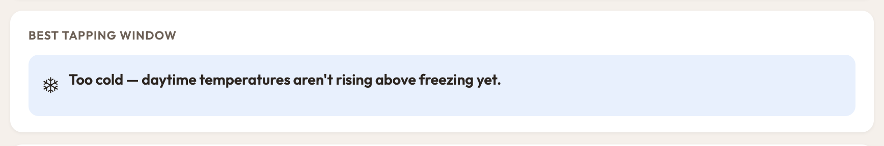

**Season over** — every night stays above freezing. Time to pull your taps.

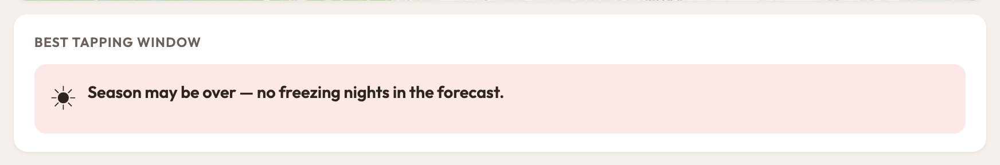

## Season timing

The forecast only sees seven days, which isn't enough to tell you that you're
running out of March. This card interpolates typical tap-by and season-end dates
from your latitude, so a quiet forecast in late season reads as *tap anyway*
rather than *wait*.

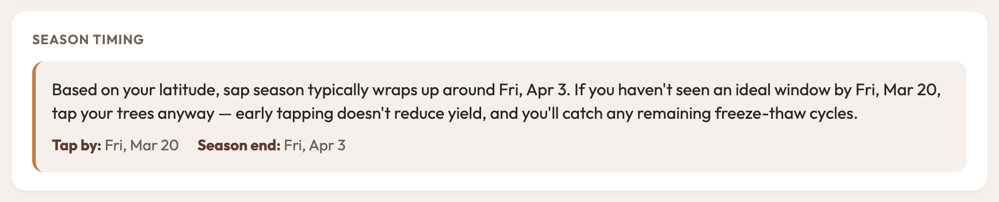

At 45.35° that lands on 20 March and 3 April. Further south both dates move
earlier; further north, later.

## The 7-day forecast

Each day gets a rating and a colour bar from its overnight low and daytime high.

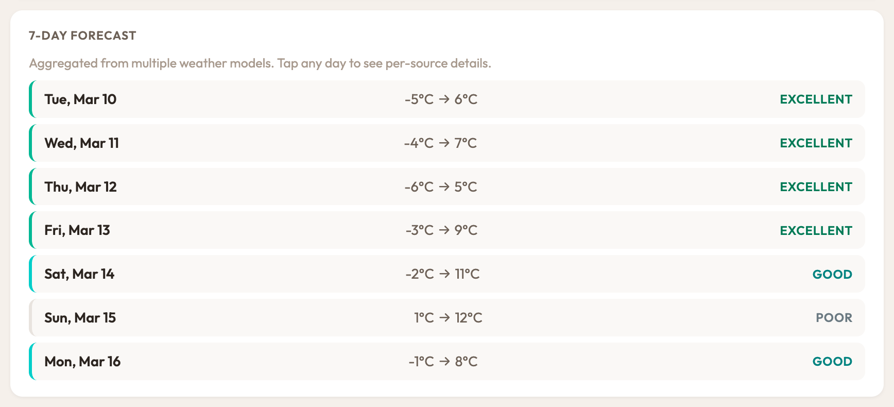

- **Excellent** — low between -7 °C and -2 °C *and* high between 4 °C and 10 °C
- **Good** — freezes overnight and thaws above 2 °C, one of the two in the
  ideal band
- **Fair** — freeze-thaw happens, but both numbers sit outside the ideal range
- **Poor** — no freeze-thaw at all: either it never froze or it never thawed

The ratings make the shape of the week obvious at a glance. Here the first three
days never freeze properly, then the run arrives:

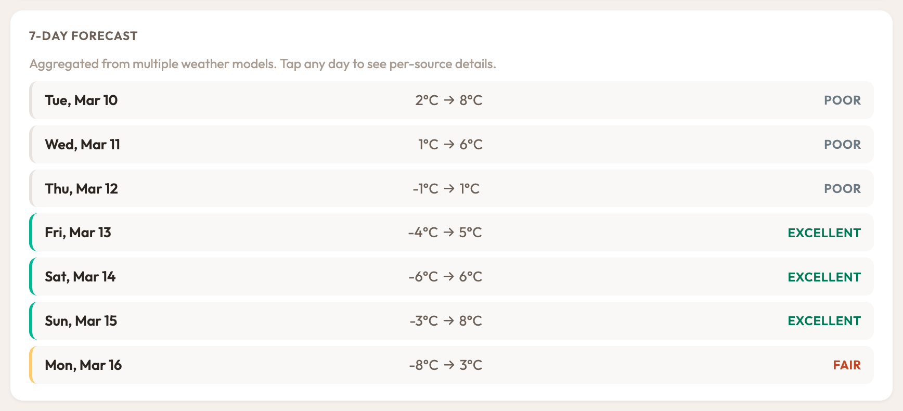

And a scrappy week — a mix of fair and poor around one good day:

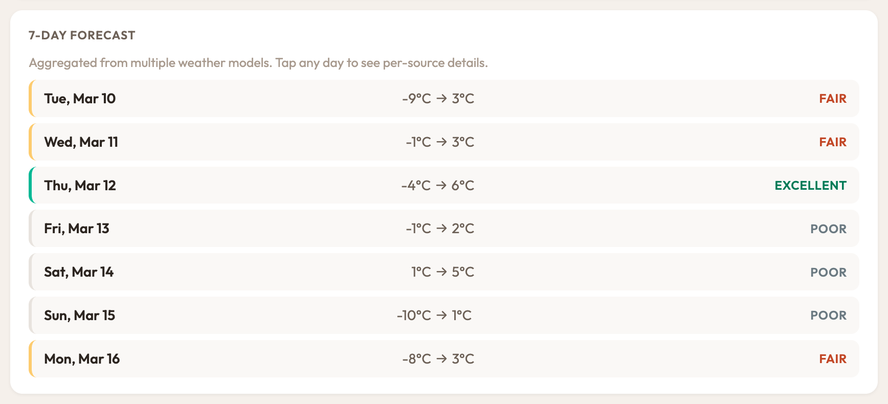

## Where the numbers come from

The high and low for each day are an average across four forecast models, which
smooths out any single model's bad call. Tap any day to see what each model
actually said.

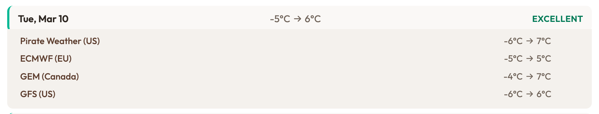

When the models disagree sharply, that's a signal the day is genuinely
uncertain — worth knowing before you commit to a boil.

## Knowing when is only half of it

Sapcast isn't only a timing tool. The bottom of the page is a standing
reference for actually doing the work — visible without JavaScript, without
location permission, and out of season.

**How It Works** explains the mechanism and what each rating means, so the
numbers above aren't a black box.

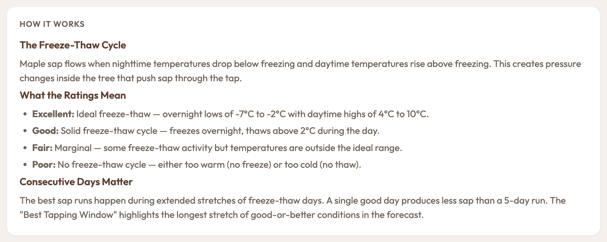

**Tapping Guides** covers the full season: choosing and drilling a tree,
collecting and boiling, when to pull your taps, and end-of-season cleanup —
each with a source you can go read.

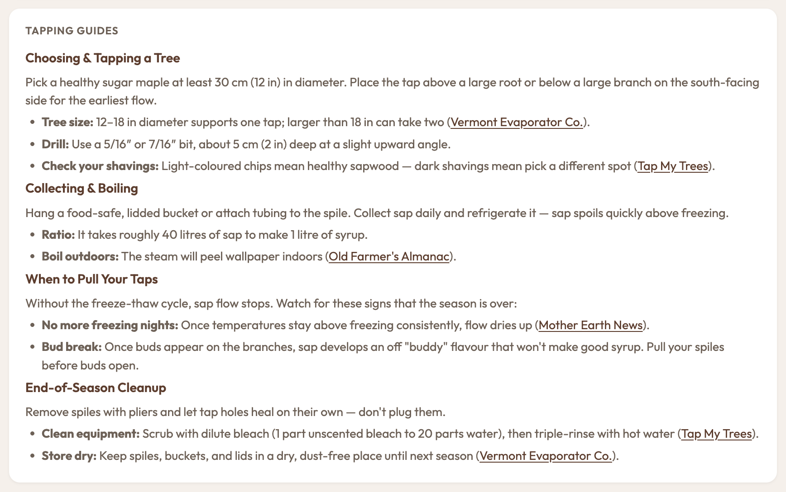

The thresholds aren't invented, and the footer says where they come from:
sap-flow research plus the university extension programs that study it.

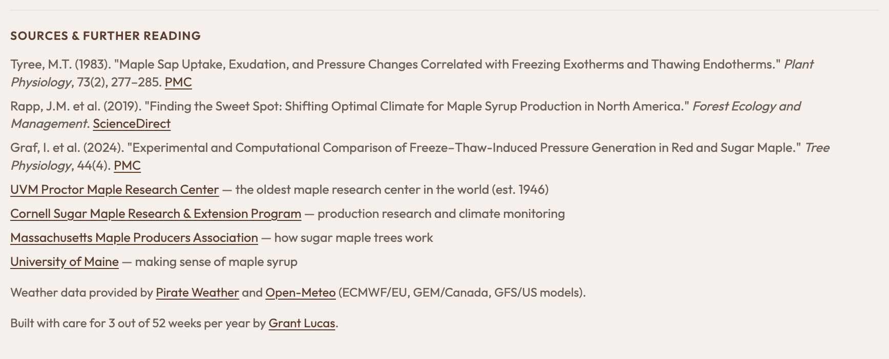

## Telling us how it went

A collapsed feedback panel, because the model is still being tuned and a real
tapper's "this was wrong" is worth more than another threshold tweak.

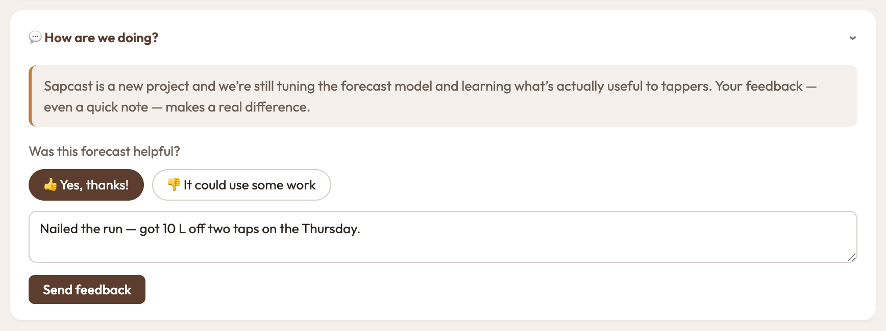

## On a phone

The layout is built for being read in a barn coat with cold hands: single
column, large touch targets, and the recommendation above the fold.

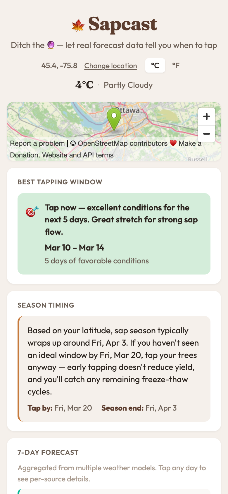

Forecast rows reflow so the day, temperatures and rating stay readable at
390 px wide.

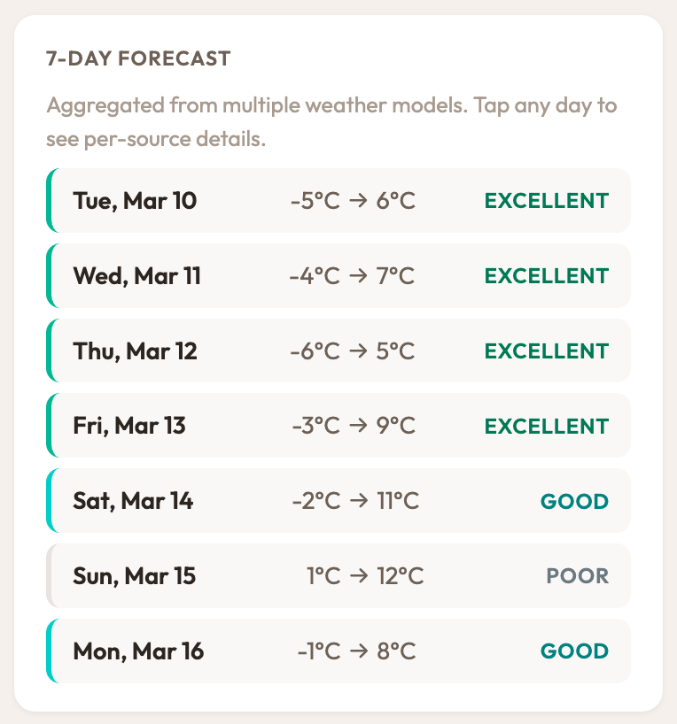

## Reproducing these screenshots

[`demo/demo-server.mjs`](demo/demo-server.mjs) proxies the real frontend from
`wrangler dev` and answers `/api/forecast` with canned temperatures, run through
the production scoring code. `/api/geocode` still passes through to the real
worker, so postal-code lookup works for real.

```bash
npm run dev                  # real worker on :8787
node demo/demo-server.mjs    # demo proxy on :8788
open http://localhost:8788
```

Switch scenarios without restarting:

```bash
curl localhost:8788/_scenarios             # list all, with resulting recommendation
curl localhost:8788/_scenario/tap-now      # tap_now     — 5-day run from today
curl localhost:8788/_scenario/upcoming     # upcoming    — 3-day run from Friday
curl localhost:8788/_scenario/marginal     # no_window   — a single good day
curl localhost:8788/_scenario/too-cold     # too_cold    — nothing thaws
curl localhost:8788/_scenario/season-over  # season_over — nothing freezes
```

Then reload the page. Requires Node 22.18+ or 23.6+, where TypeScript type
stripping is on by default — the demo server imports `src/scoring.ts` and
`src/weather.ts` directly rather than reimplementing them.

The captures above were taken at 1280 px wide and 390 px wide with a stubbed
browser geolocation so the coordinates stay fixed. Without a stub, allow
location or just type a postal code — the demo returns the same data either way.
